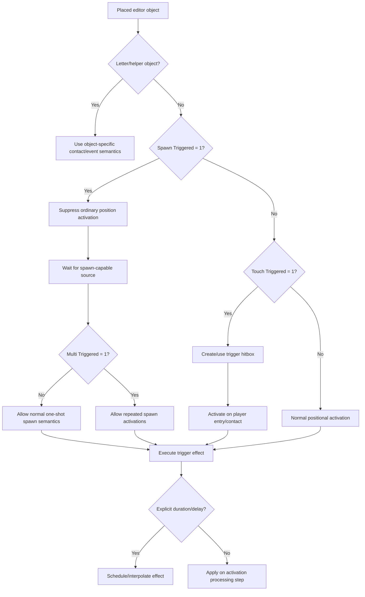
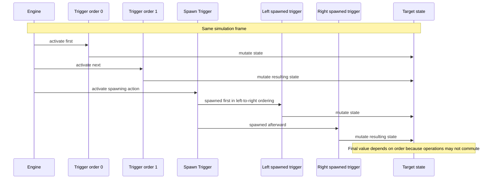
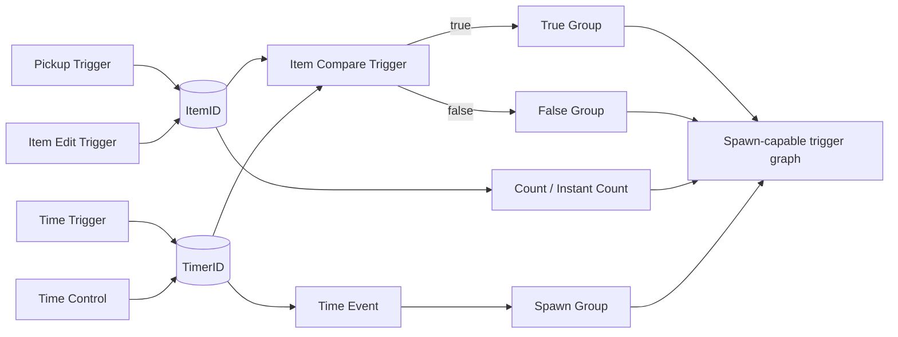
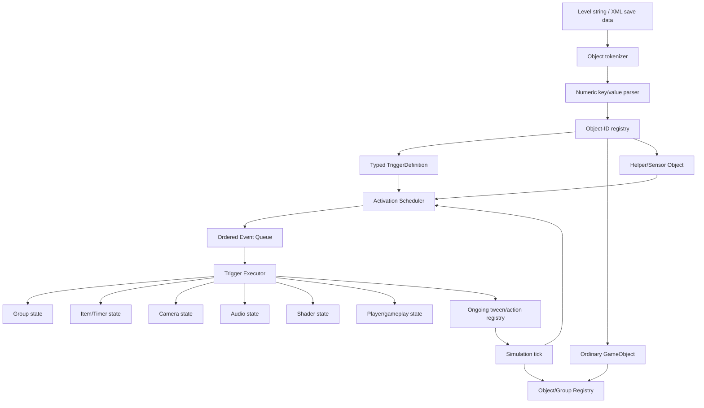

# Geometry Dash Editor Triggers: Implementation Reference for Python Agents

## Executive summary

Geometry Dash’s editor trigger system is best treated as an **event-driven object graph serialized into numeric key/value pairs**, not as a neat collection of independent “trigger commands.” The current Official Geometry Dash Wiki states that the editor has **133 trigger types, or 134 when the circular Force Block is counted separately**. The same wiki describes triggers as objects that manipulate other objects or game state, with ordinary object triggers formally arriving in Update 2.0; Update 2.2 alone added **86 new triggers** and substantially expanded camera, area, shader, audio, item, gameplay-direction, keyframe, and spawn systems. citeturn25search0turn18search1

As of September 8, 2026, the publicly announced desktop release line has reached **2.2081**. RobTop’s January 20, 2026 announcement describes 2.2081 as a bug-fix/performance follow-up to 2.208; 2.208 itself added Click Between/On Steps precision options, an editor trace system, networking improvements, and other quality-of-life changes. The Official Wiki’s Update 2.2 history likewise lists the minor-update line through 2.2081. citeturn18search0turn18search1

For implementation, there are three distinct notions of “ID” that must never be conflated:

| ID domain | Meaning | Example |
|---|---|---|
| **Object ID** | Identifies the actual placed editor object/trigger | Move Trigger = `901`; Pulse = `1006`; Gameplay Rotation = `2900` |
| **Property key** | Numeric key inside the serialized object describing a field | target group = commonly `51`; duration = commonly `10`; Spawn Triggered = `62` |
| **Logical ID** | Creator-configured GroupID, ItemID, TimerID, EffectID, BlockID, ControlID, etc. | Group `17`, Item `4`, Effect `8` |

The community reverse-engineered object format documents a level as semicolon-separated objects, where each object is itself comma-separated numeric key/value pairs. Keys `1`, `2`, and `3` are Object ID, X, and Y respectively. Thus a Move Trigger starts structurally like `1,901,2,<x>,3,<y>,...`. Integers, booleans, floats, arrays and other specialized encodings then occupy additional numeric properties. citeturn2view2turn6view0

The machine-readable package produced with this report intentionally contains **143 records**, rather than pretending that “133” resolves every historical-format question. The extra records preserve superseded color triggers, legacy transition objects, the old End trigger, helper/keyframe objects, the circular Force Block, and reverse-engineered/unlisted trigger-adjacent objects such as Object Control and Link Visible. This distinction matters to a parser: old Geometry Dash levels do not suddenly stop existing because a modern editor hid the button. The Official Wiki itself discusses superseded color triggers, an unused old End trigger and an unlisted Object Control template, while FlowVix exposes additional IDs found in current object tables. citeturn25search0turn20view0

### Machine-readable deliverables

The complete field-by-field data is available in these artifacts:

[Download the complete research bundle](sandbox:/mnt/data/geometry_dash_trigger_research_bundle.zip)

[Download the full trigger catalog JSON](sandbox:/mnt/data/gd_trigger_research/geometry_dash_trigger_catalog.json)

[Download the JSON Schema](sandbox:/mnt/data/gd_trigger_research/geometry_dash_trigger_schema.json)

[Download one representative instance of every catalog record](sandbox:/mnt/data/gd_trigger_research/geometry_dash_trigger_samples.json)

[Download the CSV summary](sandbox:/mnt/data/gd_trigger_research/geometry_dash_trigger_summary.csv)

[Download the agent README](sandbox:/mnt/data/gd_trigger_research/README.md)

The literal string `"unspecified"` in those files has a deliberate semantic meaning: **the value was not verified from a sufficiently strong public source**. It must not be silently converted to `0`, `false`, `null`, an empty string, or some plausible-looking value. Geometry Dash documentation has enough archaeological sediment already; a parser does not need to manufacture another layer.

## Data model, serialization, activation, and ordering

### Native editor-object representation

Community documentation of the client level string represents placed objects as:

```text
<object>;<object>;<object>;...
```

with one object represented as:

```text
<property-key>,<property-value>,<property-key>,<property-value>,...
```

and the universal first-order fields:

```text
1,<object-id>,2,<x>,3,<y>
```

For example, Object ID `901` is the Move Trigger according to the current FlowVix object-ID explorer. citeturn19view0turn2view2

A minimal illustrative Move Trigger object is therefore:

```text
1,901,2,450,3,300,51,17,28,10,29,0,10,1;
```

Under the documented mapping this means approximately:

```json
{
  "object_id": 901,
  "x": 450,
  "y": 300,
  "target_group": 17,
  "move_x": 10,
  "move_y": 0,
  "duration": 1.0
}
```

The Move Trigger’s `move_x` and `move_y` inputs use **tenths of a grid square**: `10` corresponds to one grid square and `1` to 0.1 grid square. Positive X moves right, negative X left; positive Y moves up, negative Y down. The Official Wiki currently reports a UI slider range of `-100..100` but an input range documented as `-9999..99999`; because that unusually asymmetric upper limit comes from community-maintained documentation, an implementation should preserve the integer rather than pre-clamping unless emulating the editor UI specifically. citeturn25search0

The current reverse-engineered property database maps, among many others, the common trigger fields:

| Semantic field | Property key | Serialized type | Verified default/range |
|---|---:|---|---|
| Touch Triggered | `11` | bool | range `0/1`; default unspecified |
| Spawn Triggered | `62` | bool | range `0/1`; default unspecified |
| Multi Triggered | `87` | bool | range `0/1`; default unspecified |
| Easing | `30` | enum | enum/domain unspecified here |
| Easing Rate | `85` | float | unspecified |
| Ignore Linked | `281` | bool | `0/1`; default unspecified |
| Ignore Group Parent | `280` | bool | `0/1`; default unspecified |

FlowVix is unusually useful because it exposes these actual property numbers, but it explicitly presents itself as an incomplete reverse-engineered information resource. Consequently, numeric property keys from it should be treated as **implementation evidence**, not as an official RobTop serialization specification. citeturn8view0turn7view0

### Ordinary, touch, spawn, and repeated activation

The Official Wiki documents three foundational trigger-activation states. An ordinary trigger activates through normal level progression. Enabling **Touch Triggered** gives the trigger a hitbox and requires the player to enter that hitbox. Enabling **Spawn Triggered** prevents normal position activation and requires the trigger to be activated through the spawn system. Enabling **Multi-Trigger** permits repeated touch/spawn activations that would otherwise be restricted to a single activation. Letter blocks are the major exception to this generalized trigger interface. citeturn25search0

Spawn-capable mechanics documented by the Wiki include Spawn, Touch, Count, Instant Count, Collision, Instant Collision, State, Time, Time Event, End, On Death, and the Toggle Block. citeturn25search0



### Same-frame precedence

Same-frame ordering is critically important because trigger operations are often **non-commutative**. A Pickup that adds `1` followed by one that multiplies by `10` produces a different result from the reverse order. GD Creator School’s current priority-order documentation describes these Update 2.2 rules:

- Spawn-triggered triggers are processed **left-to-right** in the documented spawn ordering case.
- Regular/touch triggers can use an ascending **Trigger Order** value.
- Where triggers have the same X position and same order value, the **most recently created** object receives higher placement priority.
- Ordering can be inherited through trigger/spawn chains.
- The same source warns that the Trigger Order implementation had multiple bugs as of 2.206. citeturn27search0

That means a simulator should not do the Python equivalent of `for trigger in set(active_triggers)`. Sets are delightful little entropy dispensers when the source game requires deterministic execution order.



A practical event queue should therefore preserve at least:

```python
(
    simulation_step,
    activation_family,
    trigger_order,
    spawn_horizontal_order,
    placement_priority,
    stable_object_index,
)
```

The last stable index is an implementation safeguard rather than a documented Geometry Dash field; use it only as a deterministic fallback after reproducing known engine ordering.

## Comprehensive trigger inventory

The following inventory separates the modern documented trigger set from legacy/helper/unlisted records retained by the machine dataset. Object IDs are taken from the current FlowVix object-ID database where verified; its tables directly identify, for example, `899` Color, `901` Move, `1006` Pulse, `1007` Alpha, `1049` Toggle, `1268` Spawn, `1346` Rotate, `1347` Follow, `1585` Animate, `1595` Touch, `1611` Count, and `1616` Stop. citeturn19view0turn19view1turn19view2turn19view3turn21view0turn21view3

### Core object, paired, and item triggers

| Trigger/object | Object ID | Category | Primary target/effect |
|---|---:|---|---|
| Color Trigger | `899` | Color | Color channel/group color |
| Move Trigger | `901` | Object | Group position |
| Pulse Trigger | `1006` | Color/visual | Temporary channel/group color pulse |
| Alpha Trigger | `1007` | Object/visual | Group opacity |
| Toggle Trigger | `1049` | Object | Group active/collision/render state |
| Spawn Trigger | `1268` | Paired | Spawn-triggered trigger group |
| Rotate Trigger | `1346` | Object | Group rotation |
| Follow Trigger | `1347` | Object | Group follows group |
| Shake Trigger | `1520` | Cosmetic/camera | View shake |
| Animate Trigger | `1585` | Object/cosmetic | Animation ID on group |
| Touch Trigger | `1595` | Paired/input | Player-touch-driven group operation |
| Count Trigger | `1611` | Item | ItemID threshold → group |
| Hide Player Trigger | `1612` | Cosmetic | Player visibility |
| Show Player Trigger | `1613` | Cosmetic | Player visibility |
| Counter Label / Item Counter | `1615` | Item/helper | Display ItemID/TimerID |
| Stop Trigger | `1616` | Paired | Stop/pause/resume action/control ID |
| Instant Count Trigger | `1811` | Item | Immediate ItemID comparison |
| On Death Trigger | `1812` | Event/object | Death → group activation |
| Follow Player Y Trigger | `1814` | Object | Group follows player Y |
| Collision Trigger | `1815` | Paired | Collision relation → spawned group |
| Collision Block | `1816` | Helper | Collision sensor |
| Pickup Trigger | `1817` | Item | Mutate ItemID |
| Background Effect On | `1818` | Legacy cosmetic | Background effect state |
| Background Effect Off | `1819` | Legacy cosmetic | Background effect state |
| Random Trigger | `1912` | Paired | Randomly select one of two groups |
| Advanced Random Trigger | `2068` | Paired | Weighted random, up to 20 groups |
| Scale Trigger | `2067` | Object | Group X/Y scale |
| Gravity Trigger | `2066` | Gameplay | Player gravity strength |
| Force Block | `2069` | Gameplay | Contact force |
| Advanced Follow Trigger | `3016` | Object | Physics/steering-like follow |
| Edit Advanced Follow | `3660` | Object | Mutate active advanced follow |
| Re-Target Advanced Follow | `3661` | Object | Replace advanced-follow target |
| Sequence Trigger | `3607` | Paired | Ordered group-spawn sequence |
| Instant Collision Trigger | `3609` | Paired | Immediate collision branch |
| Reset Trigger | `3618` | Paired/state | Reset target state |
| Item Edit Trigger | `3619` | Item | Arithmetic/value assignment |
| Item Compare Trigger | `3620` | Item | Value comparison → true/false groups |
| Item Persistent Trigger | `unspecified` | Item | Persistent ItemID/TimerID state |
| Persistent Item Setup | `3641` | Item/unverified | Newer persistent-item setup object |

These IDs are corroborated in the object-ID explorer’s contiguous 2.1 and 2.2 ranges. The same source identifies `2062` Edge Camera, `2063` Checkpoint, `2066` Gravity, `2067` Scale, `2068` Advanced Random and `2069` Force Block. citeturn22view0turn26view0turn26view2

The Official Wiki explicitly describes Spawn as activating only Spawn Triggered targets, documents default one-shot behavior unless Multi Activate is enabled, and describes Update 2.2’s Spawn Remap and additional spawn controls. It also distinguishes Collision Trigger from Toggle: Collision performs a spawn-style activation rather than directly imposing Toggle’s active/inactive semantics. citeturn25search0turn27search2

Advanced Random supports up to **20 groups**. For group weight \(w_i\), its documented probability is:

\[
P(i)=100\frac{w_i}{\sum_j w_j}\%
\]

Thus weights `10` and `15` correspond to `40%` and `60%`, respectively. citeturn25search0

### Area and keyframe system

| Trigger/object | ID | Function |
|---|---:|---|
| Area Move | `3006` | Move objects inside area |
| Area Rotate | `3007` | Rotate objects inside area |
| Area Scale | `3008` | Scale objects inside area |
| Area Fade | `3009` | Change opacity inside area |
| Area Tint | `3010` | Tint objects inside area |
| Edit Area Move | `3011` | Modify an Area Move effect |
| Edit Area Rotate | `3012` | Modify an Area Rotate effect |
| Edit Area Scale | `3013` | Modify an Area Scale effect |
| Edit Area Fade | `3014` | Modify an Area Fade effect |
| Edit Area Tint | `3015` | Modify an Area Tint effect |
| Area Stop | `3024` | Stop Area effect by EffectID |
| Keyframe Point | `3032` | Keyframe helper point |
| Keyframe Animation Trigger | `3033` | Run/configure keyframe animation |

FlowVix provides this contiguous 2.2 ID block directly. citeturn19view0turn21view0

All area variants share an implementation vocabulary centered on **Length**, offset, front/back modifiers, deadzone, easing, target/center and EffectID. The reverse-engineered property map gives Length key `222`, Length ± key `223`, offset key `220`, Y-offset key `252`, EffectID key `225`, target group key `51`, center group key `71`, and priority key `341`. The Official Wiki specifies the important physical unit: **Length `1` = 0.1 grid square** of radius. citeturn13view3turn25search0

Do not model Edit Area triggers as unrelated one-shot area effects. Their role is to **modify an area effect identified through Group/Effect ID state**, while Area Stop terminates area effects by EffectID. citeturn13view3turn14view1turn27search1

### Gameplay, camera, UI, and environment

| Trigger/object | ID | Function |
|---|---:|---|
| Zoom Camera | `1913` | Camera zoom |
| Static Camera | `1914` | Fix/follow camera on group |
| Offset Camera | `1916` | Camera X/Y offset |
| Reverse | `1917` | Reverse gameplay direction |
| Player Control | `1932` | Cancel player control states |
| Song | `1934` | Runtime custom-song control |
| TimeWarp | `1935` | Global game-speed multiplier |
| Rotate Camera | `2015` | Camera rotation |
| Camera Guide | `2016` | Camera framing helper |
| Edge Camera | `2062` | Camera-edge targeting |
| Checkpoint | `2063` | Platformer respawn |
| Options | `2899` | Misc. level/player options |
| Gameplay Rotation | `2900` | Direction/gravity/velocity/channel |
| Gameplay Offset Camera | `2901` | Gameplay-relative camera offset |
| Mode Camera | `2925` | Camera mode/padding/free mode |
| Edit Middleground | `2999` | MG Y-position control |
| Teleport | `3022` | Player teleport/force redirect |
| Change Background | `3029` | Background selection |
| Change Ground | `3030` | Ground selection |
| Change Middleground | `3031` | Middleground selection |
| Background Speed | `3606` | BG parallax X/Y |
| Middleground Speed | `3612` | MG parallax X/Y |
| UI Trigger | `3613` | Camera-relative custom UI |
| Event Trigger | `3604` | In-game events → spawned group |
| End Trigger | `3600` | End level |

The ID mapping around 1912–2016 and the 2899+ cluster is directly exposed by FlowVix’s current object-ID table. citeturn20view0turn23view0

The Wiki gives several implementation-critical direct values:

| State | Exact documented value |
|---|---:|
| Default camera zoom | `1.0` |
| Default gameplay channel | `0` |
| Default BG speed X | `0.1` |
| Default BG speed Y | `0.1` |
| Default MG speed X | `0.3` |
| Default MG speed Y | `0.5` |
| Default MG Y position | `0` |
| Area Length unit | `1` = `0.1` grid square |
| Move X/Y unit | `10` = `1` grid square |

citeturn25search0turn27search2

The current Fandom mirror additionally describes TimeWarp as hard-clamped to **`0.10..2.00`**, even when modified data displays an out-of-range value. Because that exact clamp is not surfaced in the Official Wiki extract, the dataset marks it as a community-verified range rather than silently upgrading it to an official guarantee. citeturn27search1

Gameplay Rotation is one of the highest-coupling triggers in the editor. It can alter gameplay direction, gravity direction, player velocity and gameplay channel. The Wiki says the active gameplay channel controls which triggers may activate and defaults to channel `0`; it also documents a bug in which Gameplay Rotation can interfere with camera triggers that were active from the start when the Gameplay Rotation trigger itself is not Touch/Spawn Triggered. citeturn27search2

### Shader and visual effects

Update 2.2 introduced the shader/post-processing system, and the current object table maps its principal objects as follows. citeturn18search1turn20view0

| Shader/effect | Object ID |
|---|---:|
| Gradient | `2903` |
| Shader layer-control trigger | `2904` |
| Shock Wave | `2905` |
| Shock Line | `2907` |
| Glitch | `2909` |
| Chromatic Aberration | `2910` |
| Chromatic Glitch | `2911` |
| Pixelate | `2912` |
| Lens Circle | `2913` |
| Radial Blur | `2914` |
| Motion Blur | `2915` |
| Bulge | `2916` |
| Pinch | `2917` |
| Grayscale | `2919` |
| Sepia | `2920` |
| Invert Color | `2921` |
| Hue | `2922` |
| Edit Color | `2923` |
| Split Screen | `2924` |

The base Shader Trigger does not itself merely mean “turn shader on.” It defines the affected **render-layer range** and can disable all active shader effects. FlowVix maps the base properties `disable_all=192`, `no_player_particles=188`, `lowest_layer=196`, and `highest_layer=197`. The Wiki independently describes the layer-range function and Disable All behavior. citeturn15view2turn27search2

Examples of shader-specific numeric property maps include:

| Trigger | Field | Key |
|---|---|---:|
| Shock Wave | speed | `175` |
| Shock Wave | strength | `176` |
| Shock Wave | thickness | `180` |
| Shock Wave | wave width | `179` |
| Shock Wave | center group | `51` |
| Glitch | strength | `176` |
| Glitch | speed | `175` |
| Pixelate | target X | `180` |
| Pixelate | target Y | `189` |
| Pixelate | hard edges | `515` |
| Radial Blur | size | `179` |
| Radial Blur | intensity | `176` |
| Motion Blur | intensity | `176` |
| Hue | degrees | `176` |

citeturn15view3turn16view0turn20view3

The repeated property numbers are intentional: **property keys are interpreted according to object type**. Key `176` is not globally “shader strength”; for one shader it may be intensity, for another target amount, and for Hue it is degrees. A Python design that creates one global `PROPERTY_176 = "strength"` constant will therefore age like milk in a furnace.

### Audio, timers, and arithmetic

| Trigger | ID | Principal serialized controls |
|---|---:|---|
| Song | `1934` | song, channel, start/end, speed, volume, loop |
| SFX | `3602` | SFX ID, speed, pitch, volume, reverb, loop, spatialization |
| Edit SFX | `3603` | SFX group/unique ID, stop/edit, area audio |
| Edit Song | `3605` | channel, stop, speed/volume edits, spatialization |
| Time | `3614` | TimerID, start/stop time, multiplier |
| Time Event | `3615` | TimerID target time → group |
| Time Control | `3617` | pause/resume timer |
| Item Edit | `3619` | arithmetic/round/sign operations |
| Item Compare | `3620` | two operands, comparison, true/false groups |
| BPM | `3642` | editor beat-grid synchronization |

The 3600-range IDs are directly listed in FlowVix. citeturn20view0turn22view2

The Song Trigger property map includes `song=392`, `speed=404`, `volume=406`, `start=408`, `fade_in=409`, `end=410`, `fade_out=411`, `loop=413`, `song_channel=432`, and `dont_reset=595`. SFX reuses several of those audio-domain keys while adding pitch `405`, reverb `407`, FFT `412`, unique ID `416`, minimum interval `434`, SFX group `455`, spatial distance controls `421..426`, and newer ± variation fields `596..599`. citeturn14view2turn14view3

Time and item triggers form a tiny dataflow language. The Wiki describes Time as a timer increasing at a nominal rate of `1/s`, modifiable by Time Mod and options such as Ignore TimeWarp, Start Paused and Do Not Override. Time Event spawns a group at a target TimerID time without inherently stopping the timer, while Time Control pauses/resumes timers. Item Compare can compare ItemIDs, TimeIDs and other supported value sources and branches to separate true/false GroupIDs. citeturn25search0

That makes a useful implementation abstraction:



### Transition, letter, and legacy objects

The Official Wiki currently documents five letter-block behaviors: D, J, S, H and F. D suppresses platform damage for wave behavior, J suppresses a held-input consecutive cube jump after an orb, S stops dash effects, H suppresses overhead damage for cube/robot/spider, and F flips gravity on overhead contact. D/J/S/H appeared in 2.1-era behavior, while F is a 2.2 addition. citeturn25search0

| Letter block | Numeric Object ID |
|---|---|
| D | `unspecified` |
| J | `unspecified` in this report’s verified mapping |
| S | `unspecified` in this report’s verified mapping |
| H | `unspecified` |
| F | `unspecified` |

The reverse-engineered table does expose objects such as Stop Jump Buffer Modifier `1813`, Stop Dash Modifier `1829`, and 2.2 Damage Square/Circle `3610/3611`, but equating those names one-to-one with every modern letter-block icon without direct verification would be an attractive little hallucination trap. They are therefore retained separately in the machine catalog instead of being forcibly merged. citeturn22view0turn20view0

For legacy transition objects, the executable/object databases retain low IDs such as:

| Legacy transition record | ID |
|---|---:|
| No Transition | `22` |
| Fade Bottom | `23` |
| Fade Top | `24` |
| Fade Left | `25` |
| Fade Right | `26` |
| Scale Up | `27` |
| Scale Down | `28` |
| Fade Around | `55` |
| Fade Around Left | `56` |
| Fade Around Right | `57` |
| Fade Horizontal | `58` |
| Fade Horizontal Inverse | `59` |
| No Enter Effect | `1915` |
| Enter Move | `3017` |
| Enter Rotate | `3018` |
| Enter Scale | `3019` |
| Enter Fade | `3020` |
| Enter Tint | `3021` |
| Enter Stop | `3023` |

The Official Wiki describes the public transition taxonomy as screen-entry/exit effects—none, four directional transitions, expanding/shrinking, diagonal variants, plus a custom-transition stop—and notes that Update 2.2 added custom enter-effect triggers. Some extra low-ID legacy transition objects remain in reverse-engineered resources but are not cleanly represented as separate current Wiki “trigger types”; the artifact marks this taxonomy uncertainty rather than deleting them. citeturn25search0

## Exact parameters and interaction semantics

The complete parameter arrays are too large to duplicate sensibly in prose: Advanced Follow alone exposes dozens of independently keyed values. They are fully expanded in `geometry_dash_trigger_catalog.json`. The following tables cover the fields most likely to cause incorrect implementations.

### Movement and transform fields

| Trigger | Field | Key | Type | Direct range/default where verified |
|---|---|---:|---|---|
| Move | duration | `10` | float | unspecified |
| Move | target group | `51` | GroupID | unspecified |
| Move | X | `28` | int | documented input `-9999..99999`; `10=1 grid` |
| Move | Y | `29` | int | `10=1 grid`; exact full range unspecified |
| Move | Lock Player X | `58` | bool | `0/1` |
| Move | Lock Player Y | `59` | bool | `0/1` |
| Move | Lock Camera X | `141` | bool | `0/1` |
| Move | Lock Camera Y | `142` | bool | `0/1` |
| Move | target-mode center | `395` | GroupID | unspecified |
| Move | target-mode target | `71` | GroupID | unspecified |
| Move | silent | `544` | bool | `0/1` |
| Move | dynamic mode | `397` | bool | `0/1` |
| Rotate | duration | `10` | float | unspecified |
| Rotate | degrees | `68` | float | unspecified |
| Rotate | ×360 | `69` | int | unspecified |
| Rotate | target | `51` | GroupID | unspecified |
| Rotate | center | `71` | GroupID | unspecified |
| Rotate | lock object rotation | `70` | bool | `0/1` |
| Scale | scale X | `150` | float | unspecified |
| Scale | scale Y | `151` | float | unspecified |
| Scale | target | `51` | GroupID | unspecified |
| Scale | center | `71` | GroupID | unspecified |
| Follow | X modifier | `72` | float | unspecified |
| Follow | Y modifier | `73` | float | unspecified |

citeturn8view0turn13view0turn25search0

A crucial special interaction is that **Lock to Player effects can accumulate**: the Wiki explicitly gives the example that applying two Player-X locks can make the object move at twice the player’s speed. The same page warns that triggers generally cannot themselves be moved by triggers, with collision blocks, letter blocks and checkpoints listed as exceptions. citeturn25search0turn27search2

### Spawn, stop, and control-flow fields

| Trigger | Field | Key | Meaning |
|---|---|---:|---|
| Spawn | target group | `51` | Trigger group to spawn |
| Spawn | delay | `63` | Delay before spawn |
| Spawn | fine/± delay | `556` | 2.2 precision/variation field |
| Spawn | preview disable | `102` | Editor-preview suppression |
| Spawn | spawn ordered | `441` | Ordered spawning |
| Spawn | remap list | `442` | ID remapping |
| Spawn | reset remap | `581` | Reset remap state |
| Stop | target | `51` | Group or ControlID |
| Stop | Use Control ID | `535` | Interpret target as control ID |
| Stop | stop/pause/resume mode | `580` | StopMode enum |
| Sequence | sequence | `435` | Sequence list |
| Sequence | mode | `436` | Sequence mode |
| Sequence | minimum interval | `437` | Timing control |
| Sequence | reset | `438` | Reset timing |
| Sequence | full-step reset | `439` | Boolean |
| Sequence | unique remap | `505` | Remapping behavior |

citeturn8view0turn13view0turn15view1

Stop, Pause and Resume are modes of the same control family rather than three unrelated object IDs. The Wiki states that Pause halts an action while retaining state, Resume continues it, and Use Control ID switches addressing from GroupID to ControlID. citeturn25search0

### Color and alpha fields

| Trigger | Representative exact fields |
|---|---|
| Color | duration `10`; R `7`; G `8`; B `9`; opacity `35`; blending `17`; target color `23`; copy color `50`; HSV `49`; copy opacity `60` |
| Pulse | target `51`; target type `52`; exclusive `86`; fade-in `45`; hold `46`; fade-out `47`; RGB `7/8/9`; HSV enable `48`; HSV `49`; copy color `50` |
| Alpha | duration `10`; target group `51`; opacity `35` |

citeturn8view0

Special color-channel IDs documented by the Wiki for 2.2 include:

```json
{
  "1000": "BG",
  "1001": "G1",
  "1002": "Line",
  "1003": "3DL",
  "1004": "Object",
  "1005": "Player Color 1",
  "1006": "Player Color 2",
  "1007": "Light BG",
  "1009": "G2",
  "1010": "Black",
  "1011": "White",
  "1012": "Lighter",
  "1013": "MG",
  "1014": "MG2"
}
```

The Wiki says values above `1014` return N/A in this special-channel context and warns that some corrupted channel values can crash the game. That is precisely why a file parser should preserve unknown channel integers while a game-emulation layer separately validates them. citeturn27search2

### Force and state precedence

For Force Block behavior, the Wiki gives a rare explicit stacking law:

```text
different ForceID  -> forces stack
same ForceID       -> forces do not stack
square vs circle   -> same force semantics, different collision geometry
```

citeturn27search2

FlowVix maps the force parameters to:

```json
{
  "relative": 528,
  "force": 149,
  "min_force": 526,
  "max_force": 527,
  "range": 529,
  "force_id": 530
}
```

citeturn16view2turn16view3

For Toggle, the semantics are also explicit: deactivating a group makes affected objects disappear and removes relevant collision; activating restores visibility and collision. The editor even changes the Toggle Trigger’s displayed color according to on/off state. citeturn25search0

For persistent items, “persistent” is **attempt/death persistence**, not save-file persistence. The Wiki/Fandom documentation says the value still resets when the user exits the level. citeturn27search1turn27search2

### Unsupported assumptions that should remain `unspecified`

No sufficiently authoritative public source located in this research pass provides a reliable universal answer for all of the following:

| Question | Machine value |
|---|---|
| Exact engine-frame latency of every trigger | `"unspecified"` |
| Every field's editor slider min/max | `"unspecified"` unless cited |
| Every field's implicit serialization default | `"unspecified"` unless cited |
| Universal collision/stacking semantics for overlapping transforms | `"unspecified"` |
| Universal rule for two simultaneous duration-based transforms targeting one object | `"unspecified"` beyond known ordering |
| Exact Split Screen serialization fields | `"unspecified"` in current artifact |
| Exact field map for newer/unlisted Link Visible | `"unspecified"` |
| Exact field map for Object Control | `"unspecified"`; Wiki says template does nothing as of 2.2 |
| Exact stable public Object ID for Item Persistent in the sources recovered here | `"unspecified"` |
| Exact ID mapping for every letter block | `"unspecified"` where not independently verified |

FlowVix’s data being explicitly incomplete is the key reason for this conservatism. Its numeric entries are extraordinarily useful, but “someone reverse-engineered a field” and “RobTop specifies this as a stable public API” are rather different propositions. citeturn7view0turn24view0turn24view1turn24view2turn24view3

## Visual appearance and editor identification

The most useful common visual source is the Official Geometry Dash Wiki’s **Triggers** page:

`https://geometrydash.wiki.gg/wiki/Triggers`

Its trigger tables have dedicated **Preview** and, for many entries, **Setup menu** columns. The page is current as of 2026 and covers the letter, color, object, paired, item, area, manipulation, cosmetic, camera, shader, audio, transition and miscellaneous categories. citeturn25search0

For a machine agent, visual recognition should be secondary to Object ID. A screenshot is useful for a human; `1,2905` is considerably less likely to become artistically ambiguous.

Some distinctive appearances explicitly described by the Wiki include:

| Object | Appearance information |
|---|---|
| Toggle Trigger | Default/deactivate state shown lobster-red; activation state light green |
| Stop Trigger | Maroon normally; Pause mode orange; Resume mode green |
| Shake Trigger | Zig-zag/seismograph-like line with `Shake` text |
| Gameplay Rotation | Arrow indicates gameplay direction; bar beneath indicates gravity orientation |
| Static Camera | Editor visualization includes yellow player-position line, green 4:3 boundary and orange current-aspect boundary |
| Item Persistent | Community wiki describes magenta body with black circle |
| Checkpoint | Active/inactive visual states shown in Wiki preview |

citeturn25search0turn27search1turn27search2

The audio trigger preview media identified by the Wiki can be reached directly through its file pages:

```text
https://geometrydash.wiki.gg/wiki/File:SongTriggerPreviewLow.mp4
https://geometrydash.wiki.gg/wiki/File:EditSongTriggerPreviewLow.mp4
https://geometrydash.wiki.gg/wiki/File:SFXTriggerPreviewLow.mp4
https://geometrydash.wiki.gg/wiki/File:EditSFXTriggerPreviewLow.mp4
```

The Wiki’s audio table identifies those preview media alongside Song, Edit Song, SFX and Edit SFX. citeturn25search0

For programmatic icon/thumbnail matching, the machine catalog stores `wiki_preview_page`, `direct_media_url` where one was verified, and a separate `editor_texture_filename` field. The latter is intentionally `"unspecified"` unless a texture filename could be linked confidently to a trigger. This avoids a surprisingly nasty class of bugs caused by assuming editor texture numbering and Object IDs always coincide.

## Implementation specification for the Python agent

### Recommended internal architecture

Do **not** implement 133 classes whose `update()` methods directly mutate one another. That design begins charmingly and ends with a Spawn Trigger recursively summoning three collision callbacks while a TimeWarp changes the clock under a paused Advanced Follow. Instead separate parsing, activation, state mutation and interpolation.



A sensible Python interface is:

```python
from dataclasses import dataclass, field
from typing import Any, Literal

Unknown = Literal["unspecified"]

@dataclass(frozen=True)
class RawObject:
    object_id: int
    x: float
    y: float
    properties: dict[int, str]

@dataclass
class TriggerEvent:
    simulation_step: int
    source_object_index: int
    trigger_order: int | None
    activation_family: str
    payload: dict[str, Any] = field(default_factory=dict)

@dataclass
class EngineState:
    groups: dict[int, Any]
    items: dict[int, float]
    timers: dict[int, float]
    camera: Any
    player: Any
    audio: Any
    shaders: Any
    active_actions: dict[Any, Any]
```

The serialized representation should remain available alongside typed fields. Geometry Dash reuses property keys according to object class, and future minor versions can expose values an older typed decoder does not understand. Throwing unknown keys away would be a parser’s version of cleaning the attic with a flamethrower.

### Suggested parsing algorithm

```python
def parse_level_objects(level_string: str) -> list[RawObject]:
    objects: list[RawObject] = []

    for raw_object in level_string.split(";"):
        if not raw_object:
            continue

        tokens = raw_object.split(",")
        if len(tokens) % 2 != 0:
            raise ValueError(
                f"Object contains an odd number of key/value tokens: {raw_object!r}"
            )

        props: dict[int, str] = {}

        for i in range(0, len(tokens), 2):
            key = int(tokens[i])
            value = tokens[i + 1]
            props[key] = value

        if 1 not in props:
            raise ValueError("Geometry Dash object is missing property key 1/object ID")

        objects.append(
            RawObject(
                object_id=int(props[1]),
                x=float(props.get(2, "0")),
                y=float(props.get(3, "0")),
                properties=props,
            )
        )

    return objects
```

This follows the documented key/value and semicolon-separated structure. citeturn2view2turn6view0

Do not validate an integer merely because a UI slider has a smaller range. The Move Trigger is a concrete example where the editor slider and typed input ranges differ. Preserve first, validate in a separate emulation/editor-compatibility layer. citeturn25search0

### Interaction policy

A robust engine should distinguish four operations:

```text
SET      replace current state
ADD      accumulate with existing state
TWEEN    create/replace/compose an ongoing time-based action
SPAWN    enqueue another trigger activation
```

Trigger-specific policy should then explicitly say which operation is legal. Known examples include:

```json
{
  "Toggle Trigger": "SET active state",
  "Pickup Trigger": "item arithmetic or override",
  "Spawn Trigger": "SPAWN",
  "Advanced Random Trigger": "weighted choice then SPAWN",
  "Stop Trigger": "terminate/pause/resume ongoing action",
  "Force Block": "ADD only across distinct ForceIDs",
  "Color/Alpha/Move/Rotate/Scale": "TWEEN or immediate target update depending on duration",
  "Shader Trigger Disable All": "clear shader effect state"
}
```

The specific Spawn, Stop, Toggle, Force and shader rules are publicly documented; for simultaneous Move/Rotate/Scale composition beyond those rules, retain an explicit `"unspecified"` behavior until verified through controlled game tests. citeturn25search0turn27search2

### Representative full-format records

A representative Move record from the generated sample file looks conceptually like:

```json
{
  "name": "Move Trigger",
  "category": "object",
  "object_id": 901,
  "json_instance": {
    "object_id": 901,
    "x": 0,
    "y": 0,
    "fields": {
      "duration": 1.0,
      "target_group": 1,
      "move_x": 1,
      "move_y": 1,
      "lock_x_player": 1,
      "lock_y_player": 1,
      "mod_x": 1.0,
      "mod_y": 1.0
    }
  },
  "editor_object_string": "1,901,2,0,3,0,10,1.0,51,1,28,1,29,1",
  "xml_plist_value_fragment": "<s>1,901,2,0,3,0,10,1.0,51,1,28,1,29,1;</s>"
}
```

The values in the sample file are expressly **representative values, not defaults**. For example, `lock_x_player: 1` is present to demonstrate serialization; it is not an assertion that the editor defaults that box to checked.

A representative weighted Advanced Random payload is:

```json
{
  "object_id": 2068,
  "list": "2.10.3.15"
}
```

FlowVix documents the advanced-random list as dot-separated group/weight pairs; the Wiki’s weight formula makes that Group 2 weight 10 and Group 3 weight 15, i.e. 40% versus 60%. citeturn15view1turn25search0

### Version and confidence policy

Each implementation record should retain:

```json
{
  "introduced": "Update 2.2",
  "status": "current",
  "verification": {
    "object_id": "verified",
    "parameter_keys": "verified_or_partial",
    "ranges_defaults": "partial",
    "effect": "verified_or_partial"
  }
}
```

That separation is essential. It is entirely possible to have a **verified Object ID**, a **verified property key**, but an **unspecified default or legal range**. Those are independent facts.

The official historical anchor is strong: Update 2.2 released on Steam on December 19, 2023 and introduced 86 new editor triggers, including camera controls, Random/Advanced Random, End, Options, Player Control, area triggers, Scale, Gravity, Gameplay Rotation/Arrow, TimeWarp, shader effects, keyframes, Event linking and SFX. Later minor updates reached 2.207, 2.208 and 2.2081. citeturn18search1turn18search0

The resulting source-confidence hierarchy used in the artifacts is therefore:

| Confidence tier | Source use |
|---|---|
| Highest | RobTop/official Steam announcements for release/version facts |
| High | Official Geometry Dash Wiki for trigger taxonomy, editor behavior, known defaults and interactions |
| Implementation evidence | FlowVix/GD object docs for raw Object IDs and property-key mappings |
| Supplemental | GD Creator School for empirically documented ordering/engine behavior |
| Unverified | Anything not corroborated sufficiently; literal `"unspecified"` |

The current Wiki itself labels substantial portions of the trigger article as work in progress, while FlowVix acknowledges incomplete data. A machine model that carries confidence metadata is therefore materially safer than one that turns gaps into invented constants. citeturn25search0turn7view0

The package files are the canonical machine-oriented companion to this report:

- [Full catalog JSON](sandbox:/mnt/data/gd_trigger_research/geometry_dash_trigger_catalog.json) — all 143 retained current/legacy/helper/unlisted records, full parameter arrays, IDs, effects, activation, target types, interactions, appearance references, representative snippets, sources and verification state.
- [JSON Schema](sandbox:/mnt/data/gd_trigger_research/geometry_dash_trigger_schema.json) — Draft 2020-12 validation schema.
- [Representative instances](sandbox:/mnt/data/gd_trigger_research/geometry_dash_trigger_samples.json) — one JSON/editor-string/XML-fragment example per catalog record.
- [CSV summary](sandbox:/mnt/data/gd_trigger_research/geometry_dash_trigger_summary.csv) — flattened index suitable for pandas, SQLite ingestion or code generation.
- [Complete ZIP bundle](sandbox:/mnt/data/geometry_dash_trigger_research_bundle.zip) — all outputs together.